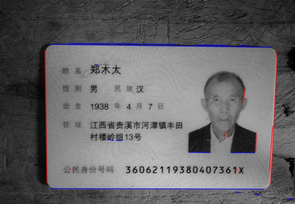
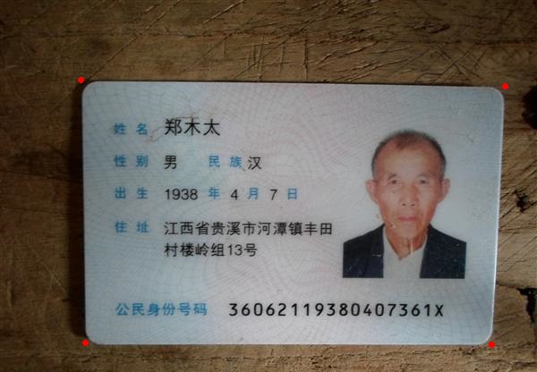
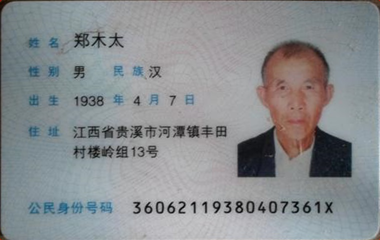

# IDCard 
# ENV : vs2013 opencv3  
##tips : [NuGet](http://www.nuget.org/) 程序包管理器 (第一次加载需要连接互联网，自动下载opencv3，并能够实现自动配置）

#examples:
### 图片来自百度图片,仅做学术交流.如果侵权请联系[我](mailto:1099905725@qq.com).
1 原始图片

2 LSD定位直线

3 寻找边缘交点

4 透视变换

