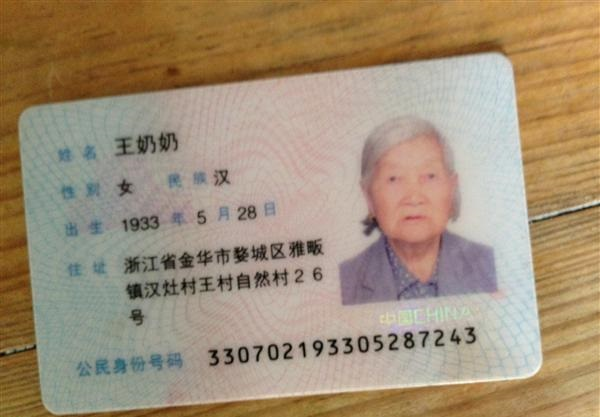

# IDCard 
# ENV : vs2013 opencv3  
##tips : [NuGet](http://www.nuget.org/) 程序包管理器 (第一次加载需要连接互联网，自动下载opencv3，并能够实现自动配置）

# Result

{
	"status": 0,
		"texts": [
		{
			"text": "36062119380407361X",
			"location": {
				"x": 0,
				"y": 0,
				"width": 0,
				"height": 0
			}
		}
		],
		"meta": {
			"code": "20121106024546582688",
		}
}
### more result in result dir
# Check nums
id.py
correct 196, total 258
precise: 75.968992%

#examples:
### 图片来自百度图片,图片仅做学术交流。如有侵权请联系[我](mailto:1099905725@qq.com)
1 原始图片

2 LSD定位直线

3 寻找边缘交点

4 透视变换

1 原始图片

2 LSD定位直线

3 寻找边缘交点

4 透视变换

##not work examples 
##if you have better methord ,please tell [me](mailto:1099905725@qq.com)

